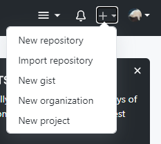
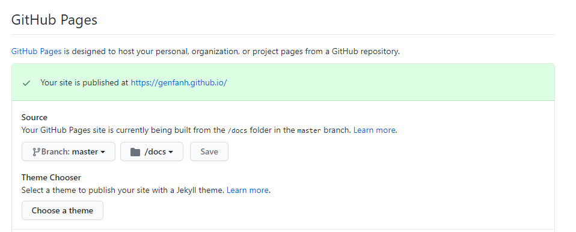
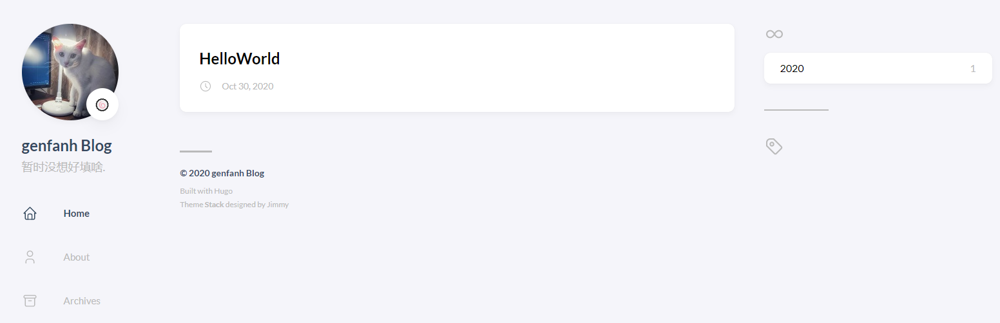

今天主要记录用hugo搭建个人博客的过程，避免下次搭建流程遗失。

## 一、安装Hugo

本人使用的是**Windows系统**，所以选择scoop安装方式。具体步骤如下：

### 1、安装scoop

参考 github [scoop](https://github.com/lukesampson/scoop) 网站安装

### 2、使用scoop安装hugo

安装hugo拓展版本，因为后续选择主题需要拓展版本，所以安装了此版本

```
scoop install hugo-extended
```

若不喜欢使用拓展版本，可以使用以下指令安装基础版本

```
scoop install hugo
```

### 3、验证hugo安装

打开CMD，输入`hugo version`，若版本正确输出则安装成功

其他平台可参考官网安装教程 [Install Hugo](https://gohugo.io/getting-started/installing/)

## 二、使用hugo创建博客

### 1、创建网站

在创建前，请进入工作目录

```
# 执行创建指令
# 其中 blog 是网站名称，即会在工作目录下创建blog名称文件夹
# 所有网站文件都在blog目录下
hugo new site blog
```

### 2、添加hugo主题

hugo有很多第三方开源的主题，可以在官网的[themes](https://themes.gohugo.io/)下自行选择。本人选[Stack主题](https://github.com/CaiJimmy/hugo-theme-stack)作为博客的主题。

主题选好后进入blog（也就是刚才创建网站是创建出来的目录）目录下，把stack主题git到themes目录下。

```
cd blog
git init
git submodule add https://github.com/CaiJimmy/hugo-theme-stack.git
```

> 注：记得提前安装git

### 3、修改config.toml配置文件

正常流程应该直接修改config.toml文件，但是Stack主题已经内置修改好的文件，直接复制该config.toml到根目录即可

```
echo 'theme = "hugo-theme-stack"' >> config.toml
```

### 4、创建第一篇文章

```
hugo new posts/HelloWorld.md
```

### 5、启动hugo服务器

```
hugo server -D
```

## 三、把Hugo部署到Github Pages上

### 1、创建一个Github仓库

在github上创建一个仓库，名称一般为<gihub名称>.github.io



### 2、把仓库clone到本地

```
git clone <REPO_URL>
```

### 3、创建hugo项目

参照第二步，在仓库目录下创建一个Hugo项目，同时保证hugo项目能在本地运行

```
hugo server -D
```

### 4、创建新文章

```
hugo new post/HelloWorld.md
```

通过指令创建的markdown文章会自动生成如下模板头：

```markdown
---
title: "HelloWorld"
date: 2020-10-30T21:52:31+08:00
draft: true
---
```

> 注：需要把 **draft: true** 改为 **draft: false** 才可以上传该篇文章

### 5、修改repo配置

进入刚刚创建的 Repository 的 Setting 界面， 把 GitHub Page 配置下的 Source 配置为Branch:master/docs。这意味着通过URL访问博客时，会从该仓库 master 分支下的 docs 文件夹下读取静态资源。具体如下图所示：



### 6、修改 config.toml

从第5点得到 GitHub Page 的 URL，把该 URL 替换到 config.toml 配置文件的 baseURL 配置值中

```
baseURL = "https://genfanh.github.io/"
```

### 7、打包网站到 /docs 文件夹下

```
hugo -d docs
```

### 8、把项目 push 到 github 仓库下

```
git commit -m "上传hugo"
git push origin master
```

### 9、查看成果

登录https://genfanh.github.io/查看是否部署成功



## 四、参考资料

[使用 Hugo + Github 搭建个人博客 - 知乎 (zhihu.com)](https://zhuanlan.zhihu.com/p/105021100?utm_source=weibo)

[Install Hugo | Hugo](https://gohugo.io/getting-started/installing/)

