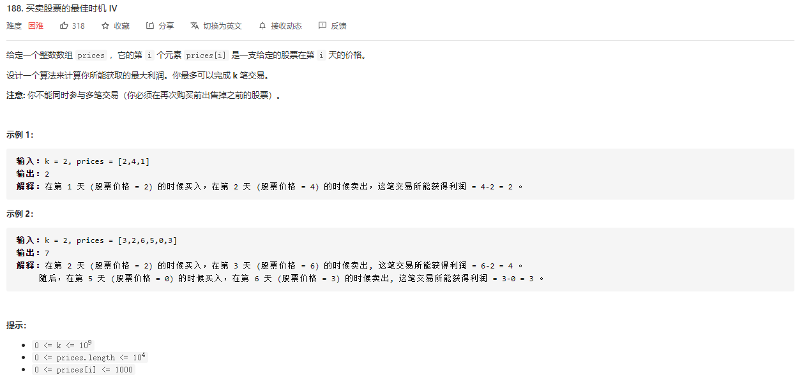
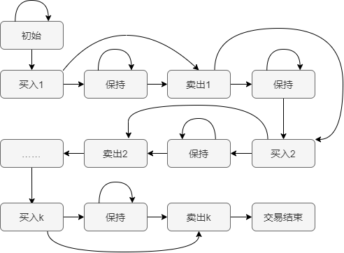

### 一、题目



### 二、解法

#### 动态规划



交易k次的状态流转图如上图所示。

初始状态时，手中没有股票，在初始状态可以保持该动作，不买不卖直至交易结束。

初始状态只能通过买入进入到买入1状态，当买入1股后，我们可以有以下两种选择：

- 啥也不做，保持买入1股状态，直至若干天后择优卖出
- 马上手上股票，进入卖出1状态

在卖出1状态时，也有两种选择：

- 啥也不做，保持手上没有股票动作，直至下一个好时机买入
- 马上进行第二次买入，进入买入2状态

后面的买入2，保持，卖出2直至卖出k后，就无法在进行交易，只能进入交易结束状态

所以在构造动态规划方程时，使用三个状态变量来表示买卖k次的交易状态

- i表示第i天
- k表示已经进行了k次买卖
- j表示当前手上是否持有股票

此时我们得到动态规划状态表达式`dp[i][k][j]`，其中

- `dp[i][k][0]`表示第i天交易了k次后手上不持有股票的累计最大利润
- `dp[i][k][1]`表示第i天交易了k次后手上持有股票的累计最大利润

此时，我们通过状态转化图，可以有

```
# 第i天交易k次后手上不持有股票的累计最大利润为， 1、第i-1天k次后手上不持有股票的累计最大利润，或 2、第i-1天k次交易后手上持有股票的累计最大利润加上第i天卖出股票 ； 1或2中的最大值
dp[i][k][0] = max( dp[i-1][k][0], d[i-1][k][1] + prices[i] )

# 第i天交易k次后手上持有股票的累计最大利润为， 1、第i-1天k次后手上持有股票的累计最大利润，或 2、第i-1天k-1次交易后手上不持有股票的累计最大利润减去第i天买入股票 ； 1或2中的最大值
dp[i][k][1] = max( dp[i-1][k][1], dp[i-1][k-1][0] - prices[i])

# 此时题目解为 第i天 0~k 次交易后，手上不持有股票的累计利润最大值
answer = max(dp[i][0~k][0])
```


### 三、代码

```go
func maxProfit(k int, prices []int) int {
    pLen := len(prices)
    if len(prices) == 0{
        return 0
    }

    //一次交易需要2天，如果交易次数大于总的天数/2，那么可以认为k是无穷大，套框架
    if k > pLen/2{
        return maxProfit_k_Inf(prices)
    }

    tmp := make([][2]int, k+1)
    dp := make([][][2]int, 0)
    for i:=0; i<pLen;i++{
        dp = append(dp, tmp)
    }
  
    for i:=0; i<pLen; i++{
        //base case
        if i == 0 {
            for d:=0; d<=k; d++{
                dp[i][d][0]=0
                dp[i][d][1]=-prices[i]  
            }
            continue
        }

        for j:=k; j>=1; j--{
            dp[i][j][0]=max(dp[i-1][j][0], dp[i-1][j][1]+prices[i])
            dp[i][j][1]=max(dp[i-1][j][1], dp[i-1][j-1][0]-prices[i])
        }
    }
    return dp[pLen-1][k][0]
}

func maxProfit_k_Inf(prices []int) int {
    if len(prices) == 0 {
        return 0
    }
    dp := make([][2]int, len(prices))

    /*
    k = +infinity
    dp[i][k][0]=max(dp[i-1][k][0], dp[i-1][k][1]+prices[i])
    dp[i][k][1]=max(dp[i-1][k][1], dp[i-1][k-1][0]-prices[i])
                =max(dp[i-1][k][1], dp[i-1][k][0]-prices[i])

    我们发现数组中的 k 已经不会改变了，也就是说不需要记录 k 这个状态了：
    dp[i][0] = max(dp[i-1][0], dp[i-1][1] + prices[i])
    dp[i][1] = max(dp[i-1][1], dp[i-1][0] - prices[i])
    */
    for i:=0; i<len(prices); i++{
         if i-1 == -1{
             dp[i][0]=0
             dp[i][1]=-prices[i]
             continue
         }
        dp[i][0] = max(dp[i-1][0], dp[i-1][1] + prices[i])
        dp[i][1] = max(dp[i-1][1], dp[i-1][0] - prices[i])
    }
    return dp[len(prices)-1][0]
}

func max(x, y int) int{
    if x > y{
        return x
    }
    return y
}
```