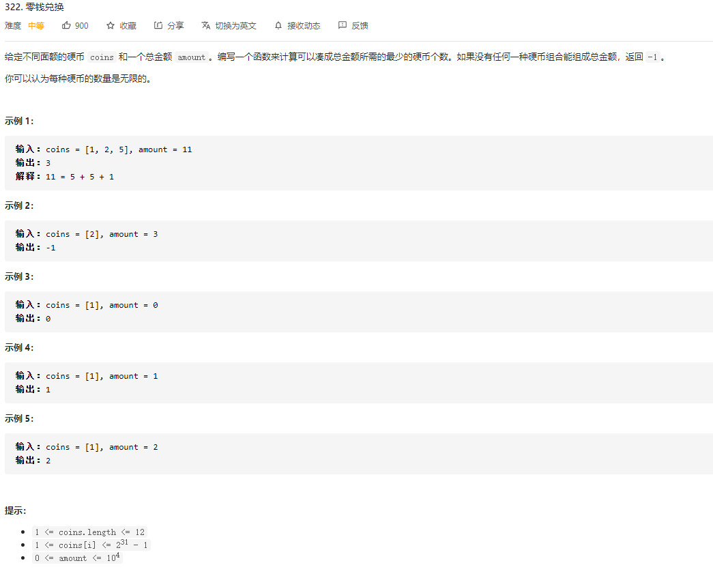

### 一、题目



### 二、解法

#### 动态规划

构造动态方程时，我们认为

- `dp[i]`为凑成i金额所需要的最少硬币的数值

所以，当所有coins面值硬币选择一个时，其凑成的dp[i-coins[j]]的数值是最小时，可以认为dp[i]最小，动态转化表达式可以有

```
dp[i] = min( dp[i-coins[j]] ) + 1
```

此时最终题解为，

- ans = dp[amount]

#### 复杂度

**时间复杂度**：O(amount * len(coins) )

**空间复杂度**：O(amount)

### 三、代码

```go
func coinChange(coins []int, amount int) int {
    if amount == 0 {
        return 0
    }
    dp := make([]int, amount+1)
    // 初始化所有 i>0 的 dp[i] 为 -1
    for i := range dp {
        if i != 0 {
            dp[i] = -1
        }
    }
    n := len(coins)
	for i:=1; i<=amount; i++ {
        minVal := math.MaxInt64
        for j:=0; j<n; j++ {
        	// 若 dp[i-coins[j]] = -1 认为 dp[i-coins[j]] 无解
            if i - coins[j] >= 0 && dp[i-coins[j]] != -1 {
                minVal = min(minVal, dp[i-coins[j]])
            }
        }
        // 若minVal没有被赋值， 则认为 dp[i] 无解
        if minVal != math.MaxInt64 {
            dp[i] = minVal + 1
        }
    }
    return dp[amount]
}

func min(x, y int) int {
    if x < y {
        return x
    }
    return y
}
```

