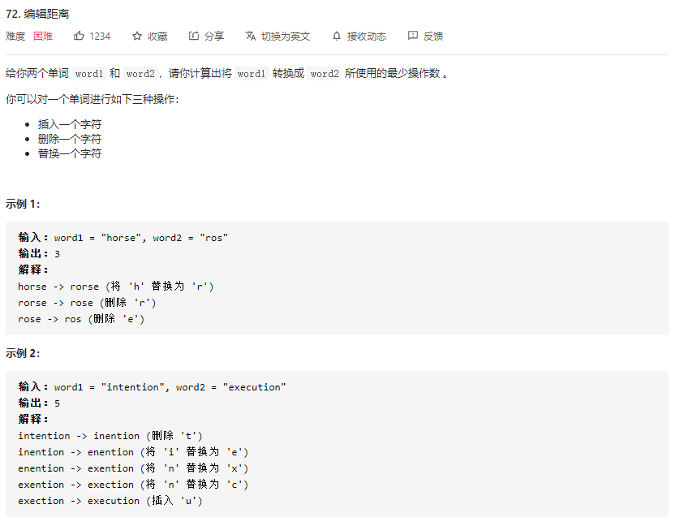
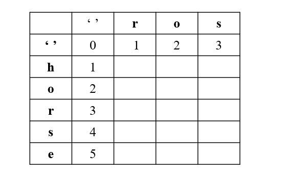

### 一、题目



### 二、解法

#### 动态规划

`dp[i][j]`代表 `word1` 的前 `i` 个字符转换成 `word2` 的前 `j` 字符需要的最少操作数

所以，

当 `word1[i] == word2[j]` 时， `dp[i][j] = dp[i-1][j-1]`

当 `word1[i] != word2[j]` 时， `dp[i][j] = min(dp[i-1][j-1], dp[i-1][j], dp[i][j-1]) + 1`

其中，`dp[i-1][j-1]` 表示替换操作， `dp[i-1][j]` 表示删除操作， `dp[i][j-1]` 表示插入操作。

注意，针对第一行和第一列需要淡入考虑，如下图所示，引入 `''`:



第一行，是 `word1` 为空时变为 `word2` 最少要走的步数，也就是插入操作

第一列，是 `word2` 为空时 `word1 `变为 `word2` 最少要走的步数， 也是删除操作

最终结果就是 `dp[i][j]`

#### 复杂度

**时间复杂度：** O(m*n)

**空间复杂度：** O(m*n)

### 三、代码

```go
func minDistance(word1 string, word2 string) int {
    n, m := len(word1), len(word2)
    dp := make([][]int, n+1)
    //  word2 为空时 word1 变为 word2 最少要走的步数
    for i:=0; i<=n; i++ {
        dp[i] = make([]int, m+1)
        dp[i][0] = i
    }
    //  word1 为空时变为 word2 最少要走的步数
    for j:=0; j<=m; j++ {
        dp[0][j] = j
    }
    for i:=1; i<=n; i++ {
        for j:=1; j<=m;j++ {
            if word1[i-1] == word2[j-1] {
                dp[i][j] = dp[i-1][j-1]
            } else {
                dp[i][j] = 1 + min(dp[i-1][j], min(dp[i][j-1], dp[i-1][j-1]))
            }
        }
    }
    return dp[n][m]
}

func min(x, y int) int {
    if x < y {
        return x
    }
    return y
}
```

