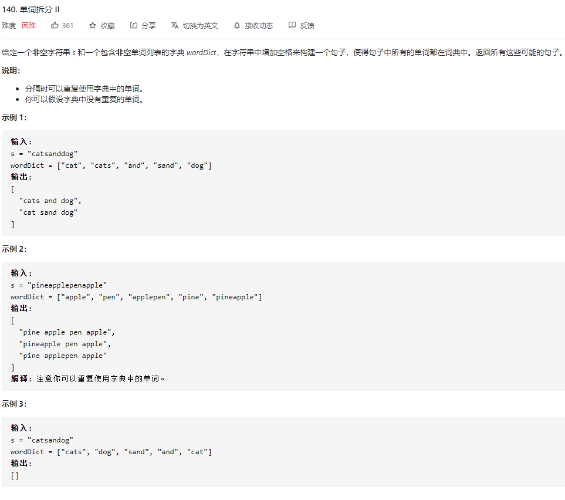
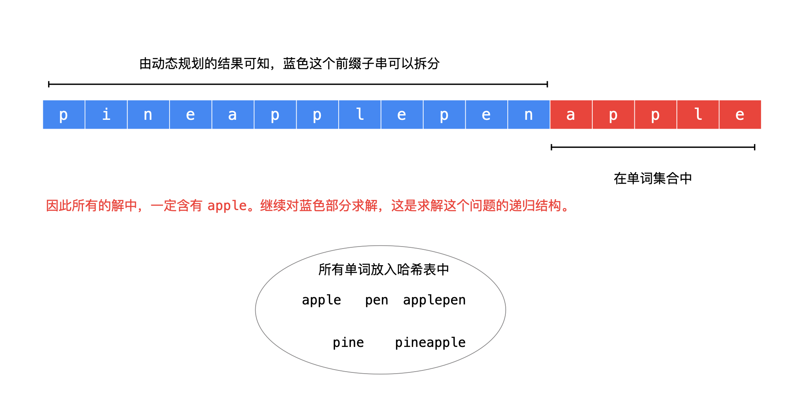

### 一、题目



### 二、解法

#### 动态规划+回溯

- 动态规划得到了原始输入字符串的任意长度的 **前缀子串** 是否可以拆分为单词集合中的单词；
- 我们以示例 2：`s = "pineapplepenapple"`、`wordDict = ["apple", "pen", "applepen", "pine", "pineapple"]` 为例，分析如何得到所有具体解。

所有任意长度的前缀是否可拆分是知道的，那么如果 **后缀子串在单词集合中**，这个后缀子串就是解的一部分，例如：




再对比这个问题的输出：

```
[
  "pine apple pen apple",
  "pineapple pen apple",
  "pine applepen apple"
]
```


可以发现，树形结构中，从叶子结点到根结点的路径是符合要求的一个解，与以前做过的回溯算法的问题不一样，这个时候路径变量我们需要在依次在列表的开始位置插入元素，可以使用队列实现。

### 三、代码

```go
func wordBreak(s string, wordDict []string) bool {
		ans := make([]string, 0)
	size := len(s)
	// 使用 map 加速查找
	wordMap := make(map[string]bool, size + 1)
	for _, word := range wordDict {
		wordMap[word] = true
	}

	// 查找是否有解
	dp := make([]bool, size+1)
	dp[0] = true
	for i:=0; i<size; i++ {
		for j:=i+1; j<=size; j++ {
			if dp[i] && wordMap[s[i:j]] {
				dp[j] = true
			}
		}
	}

	// 回溯算法，获取所有解
	path := make([]string, 0)
	var backtracking func(start int)
	backtracking = func(start int) {
		if start == size && dp[size] {
			tmp := strings.Join(path, " ")
			ans = append(ans, tmp)
			return
		}
		for i := start+1; i<=size; i++ {
			if dp[start] && wordMap[s[start:i]] {
				path = append(path, s[start:i])
				backtracking(i)
				path = path[:len(path)-1]
			}
		}
	}
	if dp[size] {
		backtracking(0)
	}
	return ans
}
```


#### 四、参考

**转载自：**[动态规划求是否有解、回溯算法求所有具体解（Java） - 单词拆分 II - 力扣（LeetCode） (leetcode-cn.com)](https://leetcode-cn.com/problems/word-break-ii/solution/dong-tai-gui-hua-hui-su-qiu-jie-ju-ti-zhi-python-d/)

