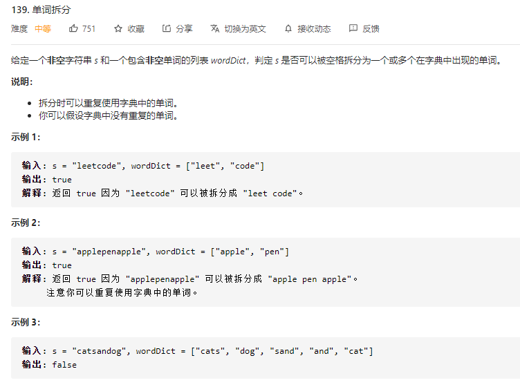
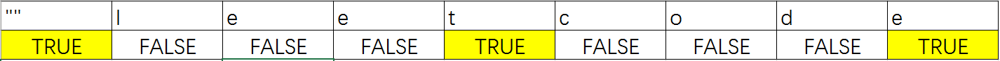

### 一、题目



### 二、解法

#### 动态规划



1. 初始化 `dp=[false, ⋯ , false]`，长度为 *n+1*。*n* 为字符串长度。`dp[i]` 表示 *s* 的前 *i* 位是否可以用 `wordDict` 中的单词表示。
2. 初始化 `dp[0]=true`，空字符可以被表示。

3. 遍历字符串的所有子串，遍历开始索引 *i*，遍历区间 *[0,n)*：
   - 遍历结束索引 *j*，遍历区间 *[i+1,n+1)*：
     - 若 `dp[i]=true`且 *s[i, ⋯ ,j)* 在 `wordlist` 中：`dp[j]=true`。解释：`dp[i]=true` 说明 *s* 的前 *i* 位可以用 `wordDict` 表示，则 *s[i, ⋯ ,j)* 出现在 `wordDict` 中，说明 *s* 的前 *j* 位可以表示。
4. 返回 `dp[n]`

#### 复杂度分析

- **时间复杂度**：O(n^2^)
- **空间复杂度**：O(n)

### 三、代码

```go
func wordBreak(s string, wordDict []string) bool {
	size := len(s)
	m := make(map[string]bool, len(wordDict))
	for _, word := range wordDict {
		m[word] = true
	}
	dp := make([]bool, size+1)
	dp[0] = true
	for i:=0; i<size; i++ {
		for j:=i+1; j<=size; j++ {
			if dp[i] && m[s[i:j]] {
				dp[j] = true
			}
		}
	}
	return dp[size]
}
```


#### 四、参考

**转载自：**[动态规划+记忆化回溯 逐行解释 python3 - 单词拆分 - 力扣（LeetCode） (leetcode-cn.com)](https://leetcode-cn.com/problems/word-break/solution/dong-tai-gui-hua-ji-yi-hua-hui-su-zhu-xing-jie-shi/)

