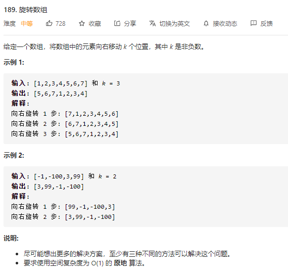

### 一、题目



### 二、解法

#### 1、方法1：使用额外数组

**算法**

我们可以用一个额外的数组来将每个元素放到正确的位置上，也就是原本数组里下标为 $i$  的我们把它放到  $(i+k)\\\% 数组长度$ 的位置。然后把新的数组拷贝到原数组中。

```go
func rotate(nums []int, k int)  {
	size := len(nums)
	ans := make([]int, size)
	for i:=0; i<size; i++ {
		ans[(i+k) % size] = nums[i]
	}
	for i:=0; i<size; i++ {
		nums[i] = ans[i]
	}
}
```

**复杂度分析**

- 时间复杂度： O(n) 。将数字放到新的数组中需要一遍遍历，另一边来把新数组的元素拷贝回原数组。
- 空间复杂度： O(n)。另一个数组需要原数组长度的空间。

#### 2、方法2：使用环状替换

**算法**

如果我们直接把每一个数字放到它最后的位置，但这样的后果是遗失原来的元素。因此，我们需要把被替换的数字保存在变量 temp 里面。然后，我们将被替换数字（temp）放到它正确的位置，并继续这个过程 *n* 次， *n* 是数组的长度。这是因为我们需要将数组里所有的元素都移动。但是，这种方法可能会有个问题，如果 $n\\%k==0$，其中 $k=k\\%n$（因为如果 k 大于 n，移动 k 次实际上相当于移动次$k\\%n$）。这种情况下，我们会发现在没有遍历所有数字的情况下回到出发数字。此时，我们应该从下一个数字开始再重复相同的过程。

现在，我们看看上面方法的证明。假设，数组里我们有 *n* 个元素并且 *k* 是要求移动的次数。更进一步，假设 $n%k=0$ 。第一轮中，所有移动数字的下标 *i* 满足 $ i\\%k==0 $ 。这是因为我们每跳 *k* 步，我们只会到达相距为 *k* 个位置下标的数。每一轮，我们都会移动  $\frac{n}{k}$ 个元素。下一轮中，我们会移动满足 $ i\\%k==1 $的位置的数。这样的轮次会一直持续到我们再次遇到  $i\\%k==1$的地方为止，此时 $i=k$。此时在正确位置上的数字共有 $k × \frac{n}{k} = k$ 个。因此所有数字都在正确位置上。

让我们看一下接下来的例子，以更好地说明这个过程：

```
nums: [1, 2, 3, 4, 5, 6]
k: 2
```


```go
func rotate(nums []int, k int)  {
	size := len(nums)
	k = k % size
	count := 0
	for start := 0; count < size; start++ {
		current := start
		prev := nums[start]
		for {
			next := (current + k) % size
			prev, nums[next] = nums[next], prev
			current = next
			count++
			if start == current {
				 break
			}
		}
	}
}
```

**复杂度分析**

- 时间复杂度：O(n) 。只遍历了每个元素一次。
- 空间复杂度：O(1) 。使用了常数个额外空间。

#### 3、方法3：使用反转

**算法**

这个方法基于这个事实：当我们旋转数组 $k$ 次， $k\\%n$ 个尾部元素会被移动到头部，剩下的元素会被向后移动。

在这个方法中，我们首先将所有元素反转。然后反转前 $k$ 个元素，再反转后面 $n−k$ 个元素，就能得到想要的结果。

假设 $n=7$ 且 $k=3$ 。

```
原始数组                  : 1 2 3 4 5 6 7
反转所有数字后             : 7 6 5 4 3 2 1
反转前 k 个数字后          : 5 6 7 4 3 2 1
反转后 n-k 个数字后        : 5 6 7 1 2 3 4 --> 结果
```

```go
func rotate(nums []int, k int)  {
	size := len(nums)
	k %= size
	r := func(ns []int, start, end int) {
		for start < end {
			nums[start], nums[end] = nums[end], nums[start]
			start++
			end--
		}
	}
	r(nums, 0, size-1)
	r(nums, 0, k-1)
	r(nums, k , size-1)
}
```

**复杂度分析**

- 时间复杂度：O(n) 。 *n* 个元素被反转了总共 3 次。
- 空间复杂度：O(1) 。 没有使用额外的空间。


### 三、参考

转载自：[旋转数组 - 旋转数组 - 力扣（LeetCode） (leetcode-cn.com)](https://leetcode-cn.com/problems/rotate-array/solution/xuan-zhuan-shu-zu-by-leetcode/)