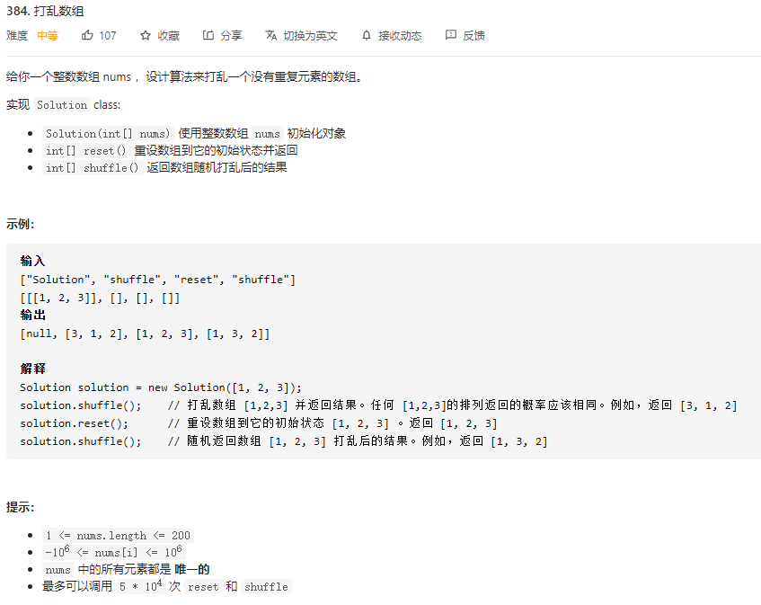

### 一、题目



### 二、解法

**方法：Fisher-Yates 洗牌算法**

Fisher-Yates 洗牌算法跟暴力算法很像。在每次迭代中，生成一个范围在当前下标到数组末尾元素下标之间的随机整数。接下来，将当前元素和随机选出的下标所指的元素互相交换 - 这一步模拟了每次从 “帽子” 里面摸一个元素的过程，其中选取下标范围的依据在于每个被摸出的元素都不可能再被摸出来了。此外还有一个需要注意的细节，当前元素是可以和它本身互相交换的 - 否则生成最后的排列组合的概率就不对了。

```go
type Solution struct {
	r *rand.Rand
	nums []int
}


func Constructor(nums []int) Solution {
	return Solution{
		r : rand.New(rand.NewSource(time.Now().UnixNano())),
		nums: nums,
	}
}


/** Resets the array to its original configuration and return it. */
func (this *Solution) Reset() []int {
	return this.nums
}


/** Returns a random shuffling of the array. */
func (this *Solution) Shuffle() []int {
	size := len(this.nums)
	ans := make([]int, size)
	copy(ans, this.nums)
	for i:=size; i>1; i-- {
		index := rand.Intn(i)
		ans[index], ans[i-1] = ans[i-1], ans[index]
	}
	return ans
}


/**
 * Your Solution object will be instantiated and called as such:
 * obj := Constructor(nums);
 * param_1 := obj.Reset();
 * param_2 := obj.Shuffle();
 */
```

**复杂度分析**

- 时间复杂度 ： *O(n)*
  
  Fisher-Yates 洗牌算法时间复杂度是线性的，因为算法中生成随机序列，交换两个元素这两种操作都是常数时间复杂度的。
  
- 空间复杂度： *O(n)*
  
  因为要实现 重置 功能，原始数组必须得保存一份，因此空间复杂度并没有优化。

### 三、参考

**转载自：** [打乱数组 - 打乱数组 - 力扣（LeetCode） (leetcode-cn.com)](https://leetcode-cn.com/problems/shuffle-an-array/solution/da-luan-shu-zu-by-leetcode/)