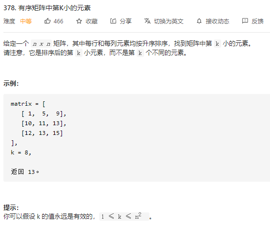
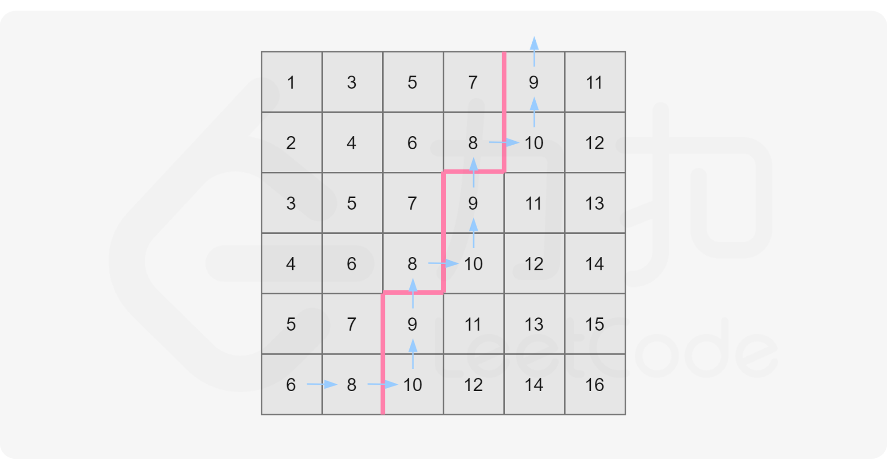

### 一、题目



### 二、解法

#### 方法1：并归排序+最小堆

**解法**

由题目给出的性质可知，这个矩阵的每一行均为一个有序数组。问题即转化为从这 nn 个有序数组中找第 kk 大的数，可以想到利用归并排序的做法，归并到第 kk 个数即可停止。

一般归并排序是两个数组归并，而本题是 nn 个数组归并，所以需要用小根堆维护，以优化时间复杂度。

具体如何归并，可以参考[23. 合并K个升序链表 - 力扣（LeetCode） (leetcode-cn.com)](https://leetcode-cn.com/problems/merge-k-sorted-lists/)。

**代码**

```go
func kthSmallest(matrix [][]int, k int) int {
	h := &IHeap{}
	// 按行把每行最小数入堆
	for i := 0; i < len(matrix); i++ {
		heap.Push(h, [3]int{matrix[i][0], i, 0})
	}

	// 从 0 ~ k - 1， 先把最小数出堆，再把最小数所在行的下一个数入堆，
	// 循环 k - 1 次之后， 所有小于 第 k小 的数都不在堆中， 并且最小的第k个数就在堆顶
	for i := 0; i < k - 1; i++ {
		now := heap.Pop(h).([3]int)
		if now[2] != len(matrix) - 1 {
			heap.Push(h, [3]int{matrix[now[1]][now[2]+1], now[1], now[2]+1})
		}
	}
	return heap.Pop(h).([3]int)[0]
}

type IHeap [][3]int

func (h IHeap) Len() int           { return len(h) }
func (h IHeap) Less(i, j int) bool { return h[i][0] < h[j][0] }
func (h IHeap) Swap(i, j int)      { h[i], h[j] = h[j], h[i] }

func (h *IHeap) Push(x interface{}) {
	*h = append(*h, x.([3]int))
}

func (h *IHeap) Pop() interface{} {
	old := *h
	n := len(old)
	x := old[n-1]
	*h = old[0 : n-1]
	return x
}
```

**复杂度分析**

时间复杂度：$O(k\log{n})$，归并 $k$ 次，每次堆中插入和弹出的操作时间复杂度均为 $\log{n}$。

空间复杂度：$O(n)$，堆的大小始终为 $n$。

> 需要注意的是，$k$ 在最坏情况下是 $n^2$，因此该解法最坏时间复杂度为 $O(n^2\log{n})$。

#### 方法2：二分查找

**解法**

由题目给出的性质可知，这个矩阵内的元素是从左上到右下递增的（假设矩阵左上角为 $matrix[0][0]$）。以下图为例：


我们知道整个二维数组中 $matrix[0][0]$ 为最小值，$matrix[n - 1][n - 1]$ 为最大值，现在我们将其分别记作 $l$ 和 $r$。

可以发现一个性质：任取一个数 $mid$ 满足 $l\leq mid \leq r$，那么矩阵中不大于 $mid$ 的数，肯定全部分布在矩阵的左上角。

例如下图，取 $mid=8$：


我们可以看到，矩阵中大于 $mid$ 的数就和不大于 $mid$ 的数分别形成了两个板块，沿着一条锯齿线将这个矩形分开。其中左上角板块的大小即为矩阵中不大于 $mid$ 的数的数量。

读者也可以自己取一些 $mid$ 值，通过画图以加深理解。

我们只要沿着这条锯齿线走一遍即可计算出这两个板块的大小，也自然就统计出了这个矩阵中不大于 $mid$ 的数的个数了。

走法演示如下，依然取 $mid=8$：



可以这样描述走法：

初始位置在 $matrix[n - 1][0]$（即左下角）；

设当前位置为 $matrix[i][j]$。若 $matrix[i][j] \leq mid$，则将当前所在列的不大于 $mid$ 的数的数量（即 $i + 1$）累加到答案中，并向右移动，否则向上移动；

不断移动直到走出格子为止。

我们发现这样的走法时间复杂度为 $O(n)$，即我们可以线性计算对于任意一个 $mid$，矩阵中有多少数不大于它。这满足了二分查找的性质。

不妨假设答案为 $x$，那么可以知道 $l\leq x\leq r$，这样就确定了二分查找的上下界。

每次对于「猜测」的答案 $mid$，计算矩阵中有多少数不大于 $mid$ ：

如果数量不少于 $k$，那么说明最终答案 $x$ 不大于 $mid$；
如果数量少于 $k$，那么说明最终答案 $x$ 大于 $mid$。
这样我们就可以计算出最终的结果 $x$ 了。

**代码**

```go

func kthSmallest(matrix [][]int, k int) int {
    n := len(matrix)
    left, right := matrix[0][0], matrix[n-1][n-1]
    for left < right {
        mid := left + (right - left) / 2
        if check(matrix, mid, k, n) {
            right = mid
        } else {
            left = mid + 1
        }
    }
    return left
}

func check(matrix [][]int, mid, k, n int) bool {
    i, j := n - 1, 0
    num := 0
    for i >= 0 && j < n {
        if matrix[i][j] <= mid {
            num += i + 1
            j++
        } else {
            i--
        }
    }
    return num >= k
}
```

**复杂度分析**

时间复杂度：$O(n\log(r-l))$，二分查找进行次数为 $O(\log(r-l))$，每次操作时间复杂度为 $O(n)$。

空间复杂度：$O(1)$。

### 三、参考

**转载自：**[有序矩阵中第K小的元素 - 有序矩阵中第K小的元素 - 力扣（LeetCode） (leetcode-cn.com)](https://leetcode-cn.com/problems/kth-smallest-element-in-a-sorted-matrix/solution/you-xu-ju-zhen-zhong-di-kxiao-de-yuan-su-by-leetco/)