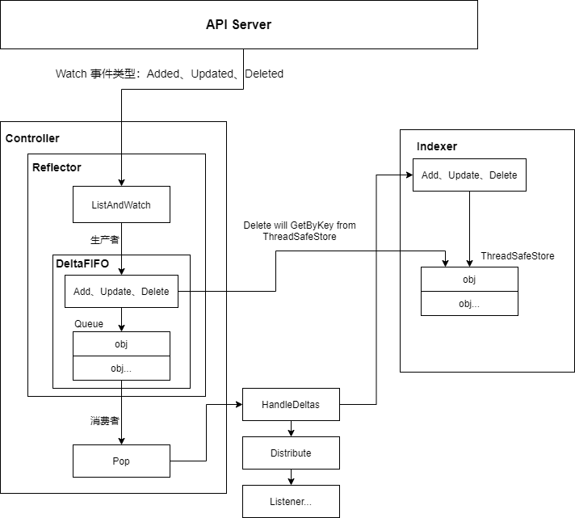
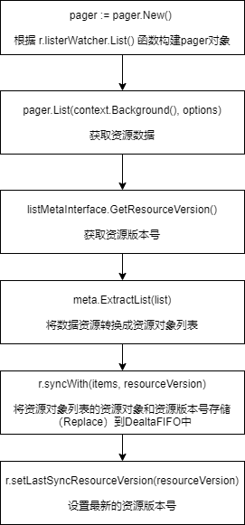
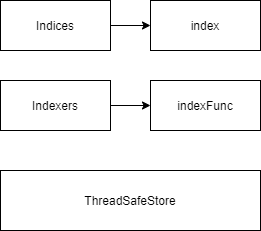

## 1. 概述
k8s其他组件如kubelet、controller manager、scheduler都是通过client-go的Informer机制与api-server进行通信。所以在阅读组件源代码时，需要先理解client-go的informer机制。
## 2. Informer架构


如图所示，Informer的中核心组件有Reflector、DeltaFIFO以及Indexer。下面对各个组件进行重点介绍：
### 2.1. Reflector
Reflector主要用作监控(Watch)Informer创建时指定的k8s资源（可以是内置资源或者CRD资源），当监控的**资源发生变化**时会触发相应的事件，如Added事件、Updated事件、Deleted事件（分别对应资源对象的添加、更新以及删除），并将该事件对应的**资源对象**存放到本地缓存DeltaFIFO中。
Reflector对象主要通过NewReflector函数进行实例化，查看函数入参可以知道，在Reflector对象实例化的时候需要传入一个ListerWatcher数据接口对象，该对象拥有List和Watch方法，用于获取和监控资源列表。Reflector对象通过Run函数驱动监控并处理监控事件，在Run函数中可以看到，Reflector主要重复运行ListAndWatch函数获取资源列表(List)并监控(Watch)资源。

**代码路径：client-go/tools/cache/reflector.go**
```go
func NewReflector(lw ListerWatcher, expectedType interface{}, store Store, resyncPeriod time.Duration) *Reflector {
	return NewNamedReflector(naming.GetNameFromCallsite(internalPackages...), lw, expectedType, store, resyncPeriod)
}

// Run repeatedly uses the reflector's ListAndWatch to fetch all the
// objects and subsequent deltas.
// Run will exit when stopCh is closed.
func (r *Reflector) Run(stopCh <-chan struct{}) {
	...
	wait.BackoffUntil(func() {
		if err := r.ListAndWatch(stopCh); err != nil {
			r.watchErrorHandler(r, err)
		}
	}, r.backoffManager, true, stopCh)
	...
}
```
ListAndWatch函数实现主要分为两个部分：1、获取资源列表数据(List)；2、监控资源对象(Watch)
#### 2.1.1. 获取资源数据(List)
ListAndWatch List流程如下图所示：


1. pager.New 主要根据ListerWatcher的List函数生成 pager 对象，若ListerWacher对象支持，Pager对象在后续调用List函数时，会使用Chunk方式分块进行获取资源列表，反之若ListerWacher对象不支持则会在一次http request中获取所有资源对象。
2. pager.List 用于获取资源下所有对象的数据，如Pod对象所有数据。获取资源数据是根据options的ResourceVersion参数控制，ResourceVersion=0表示获取所有数据；ResourceVersion!=0表示根据资源版本号继续获取，类似于断点续传功能。通过ResouceVersion保证本地缓存中数据有Etcd中数据保持一致。
3. listMetaInterface.GetResourceVersion 用于获取资源版本号，ResourceVersion（资源版本号）十分重要，Watch操作可以根据ResourceVersion判断当前资源对象是否发生改变。
4. meta.ExtractList用于将资源对象数据转换为资源对象列表，即把runtime.Object转为[]runtime.Object。
5. r.syncWith 将资源对象列表中的资源对象和对应版本号存储至DeltaFIFO中，同时会替换已经存在的对象。
6. r.setLastSyncResourceVersion 会设置最新的资源版本号。
   
ListAndWatch List代码示例：

**代码路径：client-go/tools/cache/reflector.go**
```go
func (r *Reflector) ListAndWatch(stopCh <-chan struct{}) error {
	...
	var resourceVersion string
	options := metav1.ListOptions{ResourceVersion: r.relistResourceVersion()}

	if err := func() error {
		...
		go func() {
			...
			pager := pager.New(pager.SimplePageFunc(func(opts metav1.ListOptions) (runtime.Object, error) {
				return r.listerWatcher.List(opts)
			}))
			...
			list, paginatedResult, err = pager.List(context.Background(), options)
			...
		}()

		...
		listMetaInterface, err := meta.ListAccessor(list)
		...
		resourceVersion = listMetaInterface.GetResourceVersion()
		...
		items, err := meta.ExtractList(list)
		...
		if err := r.syncWith(items, resourceVersion); err != nil {
			return fmt.Errorf("unable to sync list result: %v", err)
		}
		...
		r.setLastSyncResourceVersion(resourceVersion)
		...
	}(); err != nil {
		return err
	}
  ...
}
```
#### 2.1.2. 监控资源对象(Watch)
Watch（监控）操作通过HTTP协议与API-Server建立长连接，接收api-server发来的资源变更时间，实现的机制是使用HTTP协议的分块传输编码(Chunked Transfer Encoding)。
ListAndWatch Watch代码示例：

**代码路径：client-go/tools/cache/reflector.go**
```go
func (r *Reflector) ListAndWatch(stopCh <-chan struct{}) error {
	...
	for {
		...
		timeoutSeconds := int64(minWatchTimeout.Seconds() * (rand.Float64() + 1.0))
		options = metav1.ListOptions{
			ResourceVersion: resourceVersion,
			TimeoutSeconds: &timeoutSeconds,
			AllowWatchBookmarks: true,
		}
    ...
		w, err := r.listerWatcher.Watch(options)
		...

		if err := r.watchHandler(start, w, &resourceVersion, resyncerrc, stopCh); err != nil {
			...
			return nil
		}
	}
}
```
r.watchHandler 用于处理资源变更的事件。当出发Added事件、Updated事件、Deleted事件时，将对应的资源对象更新到本地缓存DeltaFIFO中并更新ResourceVersion版本号。
r.watchHandler 代码示例：

**代码路径：client-go/tools/cache/reflector.go**
```go
func (r *Reflector) watchHandler(start time.Time, w watch.Interface, resourceVersion *string, errc chan error, stopCh <-chan struct{}) error {
	eventCount := 0

	// Stopping the watcher should be idempotent and if we return from this function there's no way
	// we're coming back in with the same watch interface.
	defer w.Stop()

loop:
	for {
		select {
		...
		case event, ok := <-w.ResultChan():
			...
			switch event.Type {
			case watch.Added:
				err := r.store.Add(event.Object)
				...
			case watch.Modified:
				err := r.store.Update(event.Object)
				...
			case watch.Deleted:
				err := r.store.Delete(event.Object)
				...
			case watch.Bookmark:
				// A `Bookmark` means watch has synced here, just update the resourceVersion
			default:
				utilruntime.HandleError(fmt.Errorf("%s: unable to understand watch event %#v", r.name, event))
			}
			*resourceVersion = newResourceVersion
			r.setLastSyncResourceVersion(newResourceVersion)
			...
		}
	}
  ...
}

```
### 2.2. DeltaFIFO
DeltaFIFO可以分开理解，FIFO是一个先进先出队列，它拥有队列操作的基本方法（如Add、Update、Delete、List、Pop、Close等），而Delte是一个资源对象存储，用于保存资源对象的操作类型（如Added操作类型、Updated操作类型、Deleted操作类型、Sync操作类型等）。DeltaFIFO的struct结构代码如下所示：

**代码路径：client-go/tools/cache/delta_fifo.go**
```go
type DeltaFIFO struct {
	...
	items map[string]Deltas
	queue []string
  ...
}
type Delta struct {
	Type   DeltaType
	Object interface{}
}
type Deltas []Delta
```
DeltaFIFO会保留所有关于资源对象(obj)的操作类型，队列中会存在拥有**不同操作类型**的**同一个资源对象**，队列的消费者能够在处理该资源对象时能够了解该资源对象所发生的事情。DeltaFIFO作为一个先进先出的队列，有其数据的生产者和消费者，其中生产者是Reflector调用的Add方法，消费者是Controller（informer的Controller）调用的Pop方法。下面针对DeltaFIFO的核心功能：生产者方法、消费者方法以及Resync机制进行介绍。
#### 2.2.1. 生产者方法
DeltaFIFO队列中的资源对象在Added事件、Updated事件、Deleted事件中都调用了queueActionLocked函数，该函数主要根据操作类型把资源对象append到队列中，具体的代码执行流程如下：
1. 通过f.KeyOf计算资源对象的Key
2. 将actionType和资源对象构造成Delta，添加到items中，并通过dedupDeltas函数进行去重操作
3. 更新构造后的Delta并通过f.cond.Broadcast通知所有消费者解除阻塞
 
queueActionLocked代码示例如下：
 
**代码路径：client-go/tools/cache/delta_fifo.go**
```go
func (f *DeltaFIFO) queueActionLocked(actionType DeltaType, obj interface{}) error {
	id, err := f.KeyOf(obj)
	...
	oldDeltas := f.items[id]
	newDeltas := append(oldDeltas, Delta{actionType, obj})
	newDeltas = dedupDeltas(newDeltas)

	if len(newDeltas) > 0 {
		if _, exists := f.items[id]; !exists {
			f.queue = append(f.queue, id)
		}
		f.items[id] = newDeltas
		f.cond.Broadcast()
	} else {
		...
	}
	return nil
}
```
#### 2.2.2. 消费者方法
Pop方法作为消费者方法使用，该方法从DeltaFIFO的头部去除最早进入队列中的资源对象数据。在调用Pop方法时须传入process函数，该函数用于接收并处理对象的回调方法。Pop方法代码如下：

**代码路径：client-go/tools/cache/delta_fifo.go**
```go
func (f *DeltaFIFO) Pop(process PopProcessFunc) (interface{}, error) {
	f.lock.Lock()
	defer f.lock.Unlock()
	for {
		for len(f.queue) == 0 {
			...
			if f.closed {
				return nil, ErrFIFOClosed
			}

			f.cond.Wait()
		}
		id := f.queue[0]
		f.queue = f.queue[1:]
		...
		item, ok := f.items[id]
		...
		delete(f.items, id)
		err := process(item)
		if e, ok := err.(ErrRequeue); ok {
			f.addIfNotPresent(id, item)
			err = e.Err
		}
		return item, err
	}
}
```
当队列中没有数据时，通过f.cond.Wait阻塞等待数据，只有收到cond.Broadcast时才说明有数据加入队列，此时阻塞才被清除。如果队列不为空，则取出队列头，将该对象传入process函数，由上层消费者处理，若process回调函数处理出错，则将对象重新存入队列。
Controller的processLoop方法负责从DeltaFIFO队列中取出数据，并传给回调函数。而process回调函数代码示例如下：

**代码路径：client-go/tools/cache/shared_informer.go**
```go
func (s *sharedIndexInformer) HandleDeltas(obj interface{}) error {
	...
	for _, d := range obj.(Deltas) {
		switch d.Type {
		case Sync, Replaced, Added, Updated:
			...
			if old, exists, err := s.indexer.Get(d.Object); err == nil && exists {
				if err := s.indexer.Update(d.Object); err != nil {
					return err
				}
        ...
				s.processor.distribute(updateNotification{oldObj: old, newObj: d.Object}, isSync)
			} else {
				if err := s.indexer.Add(d.Object); err != nil {
					return err
				}
				s.processor.distribute(addNotification{newObj: d.Object}, false)
			}
		case Deleted:
			if err := s.indexer.Delete(d.Object); err != nil {
				return err
			}
			s.processor.distribute(deleteNotification{oldObj: d.Object}, false)
		}
	}
	return nil
}
```
HandleDeltas函数作为process回调函数，当资源对象的操作类型为Added、Updated、Deleted时，在indexer中对该资源对象进行相应操作（该操作并发安全），并通过distribute函数将资源对象分发至SharedInformer中。如Added操作即对应的informer.AddEventHandler函数。
#### 2.2.3. Resync机制
Resync机制会将Indexer本地存储中的资源对象同步到DeltaFIFO中，并将这些资源对象设置为Sync操作类型。Resync函数在Reflector中定时执行，执行周期在生成Reflector对象时，由传入的resyncPeriod参数设定。具体代码在ListAndWatch函数中，如下所示：

**代码路径：client-go/tools/cache/reflector.go**
```go
func (r *Reflector) ListAndWatch(stopCh <-chan struct{}) error {
	...
	resyncerrc := make(chan error, 1)
	cancelCh := make(chan struct{})
	defer close(cancelCh)
	go func() {
		resyncCh, cleanup := r.resyncChan()
		...
		for {
			select {
			case <-resyncCh:
			case <-stopCh:
				return
			case <-cancelCh:
				return
			}
			if r.ShouldResync == nil || r.ShouldResync() {
				...
				if err := r.store.Resync(); err != nil {
					resyncerrc <- err
					return
				}
			}
			...
		}
	}()
	...
}
```
Reflector 在 ListAndWatch 函数中启动了一个goroutine定时实行r.store.Resync操作，而在DeltaFIFO中Resync->syncKeyLocked代码如下：

**代码路径：client-go/tools/cache/delta_fifo.go**
```go
func (f *DeltaFIFO) syncKeyLocked(key string) error {
	obj, exists, err := f.knownObjects.GetByKey(key)
	...
	id, err := f.KeyOf(obj)
	...
	if err := f.queueActionLocked(Sync, obj); err != nil {
		return fmt.Errorf("couldn't queue object: %v", err)
	}
	return nil
}
```
f.knownObjects是indexer本地存储对象，通过该对象可以获取client-go目前存储的所有资源对象。
### 2.3. Indexer
Indexer是client-go用来存储资源对象并自带索引功能的本地存储，Reflector从DeltaFIFO中将消费出来的资源对象存储至Indexer。Indexer中的数据与Etcd中数据完全一致，因此client-go可以方便地从本地存储中获取数据，无需每次都从远端etcd获取，减轻api-server压力。
Indexer是在ThreadSafeMap（具有并发安全特性）的基础上进行了封装，除了继承了ThreadSafeMap的操作方法同时实现了Indexer Func等功能（如Index、IndexKyes、GetIndexers等方法），存储结构如下图所示：

#### 2.3.1. ThreadSafeMap并发安全存储
ThreadSafeMap是一个内存中的存储，数据不会写入本地磁盘中，在进行增、删、该、查操作都会进行加锁，以保证数据的一致性。ThreadSafeMap将资源对象存储于一个map数据结构中。其数据结构代码如下：

**代码路径：client-go/tools/cache/thread_safe_store.go**
```go
type threadSafeMap struct {
	lock  sync.RWMutex
	items map[string]interface{}
	// indexers maps a name to an IndexFunc
	indexers Indexers
	// indices maps a name to an Index
	indices Indices
}
```
items字段存储的是资源对象数据，其中items的key通过keyFunc函数计算得到。
#### 2.3.2. Indexer索引器
每次增、删、改ThreadSafeStore数据时，都会通过updateIndeces或deleteFromIndeices函数变更Indexer。Indexer被设计为可以自定义索引函数，其4个非常重要的数据结构为Indeices、Index、Indexer以及IndexFunc，数据结构如下：

**代码路径：client-go/tools/cache/index.go**
```go
// IndexFunc knows how to compute the set of indexed values for an object.
type IndexFunc func(obj interface{}) ([]string, error)

// Index maps the indexed value to a set of keys in the store that match on that value
type Index map[string]sets.String

// Indexers maps a name to a IndexFunc
type Indexers map[string]IndexFunc

// Indices maps a name to an Index
type Indices map[string]Index
```
- **Indexers:** 存储索引器，key为索引器名称，value为索引器实现函数。
- **IndexFunc:** 索引器函数，定义为接受一个资源对象，返回索引结果列表。
- **Indices:** 存储缓存器，key为缓存器名称，value为缓存数据。
- **Index:** 存储缓存数据，数据结构为K/V结构。 
#### 2.3.3. Indexer索引器核心实现
index.ByIndex函数通过执行索引器函数得到索引结果，代码示例：

**代码路径：client-go/tools/cache/thread_safe_store.go**
```go
func (c *threadSafeMap) ByIndex(indexName, indexedValue string) ([]interface{}, error) {
	...
	indexFunc := c.indexers[indexName]
	...
	index := c.indices[indexName]
	set := index[indexedValue]
	list := make([]interface{}, 0, set.Len())
	for key := range set {
		list = append(list, c.items[key])
	}
	return list, nil
}
```
ByIndex接收两个参数:IndexName(索引器名称)和indexKey(需要检索的key)。首先从c.indexers中查找指定的索引器函数，从c.indices中查找指定的缓存器函数，然后根据索引的indexKey从缓存数据中查到并返回
## 3. 参考文献
1. **《Kubernetes源码剖析》** **作者**：郑东旭
2. client-go源码 **版本**:release-1.20 **commit**:fb61a7c88cb9f599363919a34b7c54a605455ffc