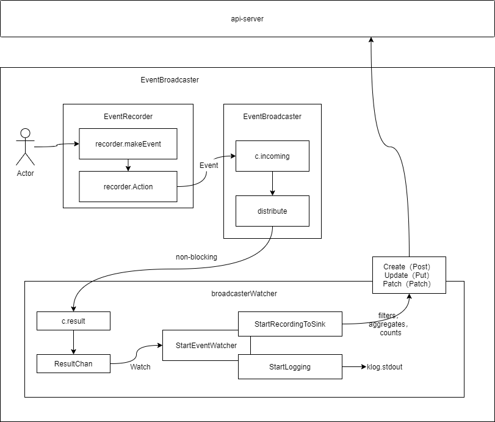

## 1. 概述
k8s的事件（Event）是一种资源对象（Resource Object），用于记录集群内发生的情况，kubernetes各个组件会把运行时发生的各种事件上报给api-server，如调度器做了什么决定等。默认情况下只会显示最近（一小时内）发生的事件。
由于k8s事件是一种资源对象，因此事件都会被存储在etcd中，而为了避免磁盘空间被填满，所以回强制执行保留策略：在最后一次的事件发生后，删除1小时之前发生的事件。
因为k8s系统中Pod资源是最核心的资源，如Deployment、StatefulSet、ReplicaSet、DaemonSet、Job、CronJob等最终都会创建出Pod。所以k8s事件也是围绕Pod进行的，在Pod的生命周期内的关键步骤中都会产生事件消息。Event资源数据结构体定义在core资源组下，具体代码示例如下：

**代码路径：vendor/k8s.io/api/core/v1/types.go**
```go
type Event struct {
	metav1.TypeMeta
	metav1.ObjectMeta
	InvolvedObject ObjectReference
	Reason string
	Message string
	Source EventSource
	FirstTimestamp metav1.Time
	LastTimestamp metav1.Time
	Count int32
	Type string
	EventTime metav1.MicroTime
	Series *EventSeries
	Action string
	Related *ObjectReference
	ReportingController string
	ReportingInstance string
}
```
Event资源数据结构体描述了当前时间段内发生了哪些关键性事件。事件有两种类型：Normal（正常事件）和Warning（警告事件）。代码示例如下：
```go
const (
	// Information only and will not cause any problems
	EventTypeNormal string = "Normal"
	// These events are to warn that something might go wrong
	EventTypeWarning string = "Warning"
)
```
## 2. 架构

EventBroadcaster事件运行原理如**图1**所示，Actor可以看做k8s系统中任一组件，当组件发生关键性事务时，可通过EventRecorder记录该事件，事件管理机制可以分为以下几个部分：
- **EventRcorder：** 事件（Event）生产者，也可叫做事件记录器。k8s系统组件通过EventRecorder记录关键性事件。
- **EventBroadcaster：** 事件（Event）消费者，也叫做事件广播器。EventBroadcaster消费EventRecorder产生的事件兵分发给其已经连接的broadcasterWatcher。分发机制分为非阻塞分发和阻塞分发。
- **broadcasterWatcher：** 观察者（Wathcer）用于定义事件的处理方式，如上传事件带api-server。
### 2.1. EventRecorder
EventRecorder主要通过Eventf方法进行事件的记录，接口代码如下所示：

**代码路径：vendor/k8s.io/client-go/tools/record/event.go**
```go
type EventRecorder interface {
	Event(...)
	Eventf(...)
	AnnotatedEventf(...)
}
```
- **Event:** 对刚发生的事件进行记录
- **Eventf:** 与Event方法类似，只是使用fmt.Sprintf对信息进行格式化
- **AnnotatedEventf:** 与Eventf类型，但是附在了注释（Annotation）字段
Eventf方法记录当前事件路径为，Event -> recorder.makeEvent -> recorder.Action。Action函数通过goroutine操作实现一部操作，主要把Event对象写入m.incoming Channel中，完成事件的生产流程。Action函数代码示例如下：

**代码路径：vendor/k8s.io/apimachinery/pkg/watch/mux.go**
```go
func (m *Broadcaster) Action(action EventType, obj runtime.Object) {
	m.incoming <- Event{action, obj}
}
```
### 2.2. EventBroadcaster
EventBroadcaster消费EventRecorder记录的事件并分发给目前所有已经连接到该Eventbroadcaster的broadcasterWatcher。EventBroadcaster通过NewBroadcaster函数进行实例化：

**代码路径：vendor/k8s.io/client-go/tools/record/event_broadcaster.go**
```go
func newBroadcaster(sink EventSink, sleepDuration time.Duration, eventCache map[eventKey]*eventsv1.Event) EventBroadcaster {
	return &eventBroadcasterImpl{
		Broadcaster:   watch.NewBroadcaster(maxQueuedEvents, watch.DropIfChannelFull),
		eventCache:    eventCache,
		sleepDuration: sleepDuration,
		sink:          sink,
	}
}
```
在实例化过程中，回通过watch.NewBroadcaster函数在内部启动一个goroutine（m.loop函数）对m.incoming进行监控，并将监控的事件通过m.distribute函数分发给所有已经连接的broadcasterWatcher。通过m.fullChannelBehaboir标志区分分发机制，若标志为DropIfChannelFull时为非阻塞分发，此时w.result缓冲区满时事件会丢失；反之，为阻塞分发，事件不会丢失。m.loop和m.distribute代码如下：

**代码路径：vendor/k8s.io/apimachinery/pkg/watch/mux.go**
```go
func (m *Broadcaster) loop() {
	// Deliberately not catching crashes here. Yes, bring down the process if there's a
	// bug in watch.Broadcaster.
	for event := range m.incoming {
		if event.Type == internalRunFunctionMarker {
			event.Object.(functionFakeRuntimeObject)()
			continue
		}
		m.distribute(event)
	}
	m.closeAll()
	m.distributing.Done()
}

func (m *Broadcaster) distribute(event Event) {
	if m.fullChannelBehavior == DropIfChannelFull {
		for _, w := range m.watchers {
			select {
			case w.result <- event:
			case <-w.stopped:
			default: // Don't block if the event can't be queued.
			}
		}
	} else {
		for _, w := range m.watchers {
			select {
			case w.result <- event:
			case <-w.stopped:
			}
		}
	}
}
```
### 2.3. broadcasterWatcher
broadcasterWatcher是每个k8s系统组件自定义处理事件的方式，如上报事件到api-server。每个broadcasterWatcher拥有三种自定义处理事件的函数：
- **StartLogging：** 将事件写入日志中
- **StartRecordingToSink：** 将事件上报至api-server并存储到etcd中
- **StartStructuredLogging：** 将事件根据入参的等级写入日志中
这StartLogging、StartRecordingToSink以及StartStructuredLogging函数依赖于StartEventWatcher函数，该函数内置了一个goroutine，不断的监控EventBroadcaster来发现事件并调用相关函数对事件进行处理。
下面对StartRecordingToSink函数进行重点介绍，如kubelet组件中的broadcasterWatcher为例，组件将v1core.EventSinkImpl作为上报事件的自定义函数。

**代码路径：cmd/kubelet/app/server.go**
```go
// makeEventRecorder sets up kubeDeps.Recorder if it's nil. It's a no-op otherwise.
func makeEventRecorder(kubeDeps *kubelet.Dependencies, nodeName types.NodeName) {
	...
	eventBroadcaster.StartStructuredLogging(3)
	if kubeDeps.EventClient != nil {
		...
		eventBroadcaster.StartRecordingToSink(&v1core.EventSinkImpl{Interface: kubeDeps.EventClient.Events("")})
	} else {
		...
	}
}
```
上报事件有3种方法：Create、Update、Patch。以Create方法为例，Create -> e.Interface.CreateWithEventNamespace(event)，该方法上报通过RESTClient发送POST请求，将事件发送到api-server。代码示例如下：

**代码路径：vendor/k8s.io/client-go/kubernetes/typed/core/v1/event_expansion.go**
```go
func (e *events) CreateWithEventNamespace(event *v1.Event) (*v1.Event, error) {
	...
	result := &v1.Event{}
	err := e.client.Post().
		NamespaceIfScoped(event.Namespace, len(event.Namespace) > 0).
		Resource("events").
		Body(event).
		Do(context.TODO()).
		Into(result)
	return result, err
}
```
## 3. 参考文献
1. **《Kubernetes源码剖析》** **作者**：郑东旭
2. k8s源码 **版本**:release-1.20 **commit**:9158049ccd96cea766756c2c6370b728472e2246