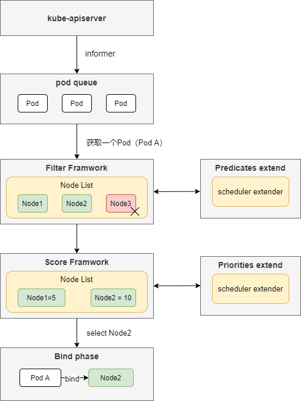

学完client-go之后，借着之前云原生社区的[Kubernetes 源码研习社](https://github.com/cloudnativeto/sig-k8s-source-code)项目机会，继续把scheduler源码学习完毕。

本文是schuduler源码学习阅读的第一篇文章。

## kube-scheduler架构设计

kube-scheduler组件是kubernetes默认的调度器，kube-scheduler组件内置的预选和优选算法，主要负责把创建的Pod调度到具体的Work工作节点上，完成Pod到Node的调度和预绑定工作（具体的绑定完成在kube-apiserver组件上完成）。



<center>kube-scheduler架构图</center>

如kube-scheduler架构图所示，kube-scheduler通过informer从kube-apiserver维护一个还未绑定到Node的待调度Pod队列，每个调度循环中，scheduler会从Pod queue中获取一个Pod，根据scheduler框架的**filter阶段（预选阶段）**和**Score阶段（优选阶段)**从待绑定的Node列表中选出最优Node，最后通过**绑定阶段**把Pod绑定到最优的Node节点上。

- **filter阶段（预选阶段）**：根据Pod需要的CPU、内存、端口等资源情况，直接过滤掉不符合Pod资源条件的Node节点
- **Score阶段（优选阶段）**：根据Pod的节点亲和性、资源情况等进行归一化打分，选出分数最优的Node节点。
- **绑定阶段**：该阶段主要把Pod预绑定到选出的Node上，并择机把绑定结果上传到kube-apiserver，由kube-apiserver完成实际绑定操作。

## kube-scheduler启动流程

kube-scheduler组件程序入口在 ` cmd/kube-scheduler/scheduler.go `文件的` main() `函数中，该函数主要完成了命令行解析和运行scheduler工作。

**代码路径：** cmd/kube-scheduler/scheduler.go:33  

```go
func main() {
  ...
  // 1、 创建cobra.Command对象， cobra主要用来解析scheduler命令行参数 
  command := app.NewSchedulerCommand()

  // 2、 初始化 log
  pflag.CommandLine.SetNormalizeFunc(cliflag.WordSepNormalizeFunc)
  logs.InitLogs()
  defer logs.FlushLogs()

  // 3、运行 command 对象的 Run 成员对应的函数， 该函数 在 cmd/kube-scheduler/app/server.go:117
  if err := command.Execute(); err != nil {
    os.Exit(1)
  }
}
```

上面的` Execute() `方法实际执行的是` cmd/kube-scheduler/app/server.go:117 `的` runCommand() `方法

```go
func runCommand(cmd *cobra.Command, args []string, opts *options.Options, registryOptions ...Option) error {
  ...
  // 1、装载生成一个scheduler.Scheduler对象
  //   Setup 方法中进行了以下操作：
  //    a) 准备了 kube-clients
  //    b) 装载了 领导者选举
  //    c) 实例化了Informers
  //    d) 实例化调度算法的函数（预选、优选算法）
  //    e) addAllEventHandlers为所有informer对象添加对资源事件的监控
  cc, sched, err := Setup(ctx, args, opts, registryOptions...)
  if err != nil {
    return err
  }
  ...
  // 2、通过装载好的Scheduler对象，执行真正的scheduler流程
  return Run(ctx, cc, sched)
}
```

` Run() `函数主要进行以下操作：

- 准备事件(Event)广播器
- 启动healthz 、metrics、scheduler server，主要监听10251 和 10259 端口，前者为非安全端口（可访问healthz/metics），后者为安全端口，需要进行认证
- 启动所有informer，并通过informer同步所有信息到本地cache中
- 当领导者选举设置时，运行领导者选举方法
- 执行` sched.Run(ctx) `方法，该方法执行scheduler主逻辑

**代码路径：** cmd/kube-scheduler/app/server.go:141 

```go
func Run(ctx context.Context, cc *schedulerserverconfig.CompletedConfig, sched *scheduler.Scheduler) error {
  ...
  // 1、 准备 event broadcaster.
  if cc.Broadcaster != nil && cc.EventClient != nil {
    cc.Broadcaster.StartRecordingToSink(ctx.Done())
  }
  if cc.CoreBroadcaster != nil && cc.CoreEventClient != nil {
    cc.CoreBroadcaster.StartRecordingToSink(&corev1.EventSinkImpl{Interface: cc.CoreEventClient.Events("")})
  }
  // 2、准备并启动healthz服务.
  var checks []healthz.HealthChecker
  if cc.ComponentConfig.LeaderElection.LeaderElect {
    checks = append(checks, cc.LeaderElection.WatchDog)
  }

  if cc.InsecureServing != nil {
    separateMetrics := cc.InsecureMetricsServing != nil
    handler := buildHandlerChain(newHealthzHandler(&cc.ComponentConfig, separateMetrics, checks...), nil, nil)
    if err := cc.InsecureServing.Serve(handler, 0, ctx.Done()); err != nil {
      return fmt.Errorf("failed to start healthz server: %v", err)
    }
  }
  // 3、启动metrics服务
  if cc.InsecureMetricsServing != nil {
    handler := buildHandlerChain(newMetricsHandler(&cc.ComponentConfig), nil, nil)
    if err := cc.InsecureMetricsServing.Serve(handler, 0, ctx.Done()); err != nil {
      return fmt.Errorf("failed to start metrics server: %v", err)
    }
  }
  // 4、启动scheduler安全服务
  if cc.SecureServing != nil {
    handler := buildHandlerChain(newHealthzHandler(&cc.ComponentConfig, false, checks...), cc.Authentication.Authenticator, cc.Authorization.Authorizer)
    // TODO: handle stoppedCh returned by c.SecureServing.Serve
    if _, err := cc.SecureServing.Serve(handler, 0, ctx.Done()); err != nil {
      // fail early for secure handlers, removing the old error loop from above
      return fmt.Errorf("failed to start secure server: %v", err)
    }
  }

  // 5、启动所有informer.
  go cc.PodInformer.Informer().Run(ctx.Done())
  cc.InformerFactory.Start(ctx.Done())

  // 6、等待所有informer获取信息到本地cache中.
  cc.InformerFactory.WaitForCacheSync(ctx.Done())

  // 7、若领导者选举不为空，开始进行领导者选举.
  if cc.LeaderElection != nil {
    cc.LeaderElection.Callbacks = leaderelection.LeaderCallbacks{
      OnStartedLeading: sched.Run,
      OnStoppedLeading: func() {
        klog.Fatalf("leaderelection lost")
      },
    }
    leaderElector, err := leaderelection.NewLeaderElector(*cc.LeaderElection)
    if err != nil {
      return fmt.Errorf("couldn't create leader elector: %v", err)
    }

    leaderElector.Run(ctx)

    return fmt.Errorf("lost lease")
  }

  // 8、执行scheduler主逻辑
  sched.Run(ctx)
  return fmt.Errorf("finished without leader elect")
}
```

`sched.Run()`主要执行以下步骤

- 等待Cache同步完毕
- 启动控制Pod队列的goroutines
- 通过 `wait.UntilWithContext()` 方法，定时调用` sched.scheduleOne() `方法，` sched.scheduleOne() `方法完成一轮调度

` pkg/scheduler/scheduler.go:360 `

```go
// Run begins watching and scheduling. It waits for cache to be synced, then starts scheduling and blocked until the context is done.
func (sched *Scheduler) Run(ctx context.Context) {
  // 1、等待cache同步完成
  if !cache.WaitForCacheSync(ctx.Done(), sched.scheduledPodsHasSynced) {
    return
  }
    // 2、启动Pod队列Goroutines
  sched.SchedulingQueue.Run()
    // 3、启动通过sched.scheduleOne()方法定时调度的goroutines
  wait.UntilWithContext(ctx, sched.scheduleOne, 0)
  sched.SchedulingQueue.Close()
}
```

` sched.scheduleOne() `方法调用一次就为一个Pod完成一次调度轮次，该方法主要逻辑如下

1. 从Pod队列汇总获取一个Pod
2. 同步执行Filter和Score阶段，为Pod选取合适的Node
3. 假设Pod运行在选取好的Node上，运行Reserve插件，从该节点上保留下所需的资源
4. 执行Permit插件，该插件主要是用作Bind前等待，可能场景是同一组Pod需要同时绑定和调度到节点上
5. 启动一个额外goroutine，执行prebind插件和postbind插件完成Pod到Node的绑定操作

` pkg/scheduler/scheduler.go:520 `

```go
func (sched *Scheduler) scheduleOne(ctx context.Context) {
    // 1、 从pod queue 队列中获取一个Pod
  podInfo := sched.NextPod()
  ......

    // 2、调用sched.Algorithm.Schedule()执行Filter和Score阶段，尝试获取一个可行的Node
  start := time.Now()
  state := framework.NewCycleState()
  state.SetRecordPluginMetrics(rand.Intn(100) < pluginMetricsSamplePercent)
  schedulingCycleCtx, cancel := context.WithCancel(ctx)
  defer cancel()
  scheduleResult, err := sched.Algorithm.Schedule(schedulingCycleCtx, prof, state, pod)
  ......

  // 3、运行 "reserve" plugins.
  if sts := prof.RunReservePlugins(schedulingCycleCtx, state, assumedPod, scheduleResult.SuggestedHost); !sts.IsSuccess() {
    sched.recordSchedulingFailure(prof, assumedPodInfo, sts.AsError(), SchedulerError, sts.Message())
    metrics.PodScheduleErrors.Inc()
    return
  }

  // 4、假设Pod已经调度到对应节点上
  err = sched.assume(assumedPod, scheduleResult.SuggestedHost)
  ......

  // 5、运行 "permit" plugins.
  runPermitStatus := prof.RunPermitPlugins(schedulingCycleCtx, state, assumedPod, scheduleResult.SuggestedHost)
  ......

  // bind the pod to its host asynchronously (we can do this b/c of the assumption step above).
    // 6、启动一个goroutines， 异步执行prebind和postbind
  go func() {
    ......
    // 6.1 启动 "prebind" plugins.
    preBindStatus := prof.RunPreBindPlugins(bindingCycleCtx, state, assumedPod, scheduleResult.SuggestedHost)
    ......
    
        // 6.2 执行bind操作
    err := sched.bind(bindingCycleCtx, prof, assumedPod, scheduleResult.SuggestedHost, state)
    metrics.E2eSchedulingLatency.Observe(metrics.SinceInSeconds(start))
    if err != nil {
      ......
    } else {
      ......
      // 6.3 启动 "postbind" plugins.
      prof.RunPostBindPlugins(bindingCycleCtx, state, assumedPod, scheduleResult.SuggestedHost)
    }
  }()
}
```

为Pod选取Node的逻辑主要在` sched.Algorithm.Schedule() `，该方法主要执行以下操作

- 执行prefilter插件，过滤资源不合适节点
- 执行preioritize方法，为剩下的节点进行归一化打分
- 根据priority结果执行selectHost操作，选择最优节点

` pkg/scheduler/generic_scheduler.go:147 `

```go
func (g *genericScheduler) Schedule(ctx context.Context, prof *profile.Profile, state *framework.CycleState, pod *v1.Pod) (result ScheduleResult, err error) {
  ......

  // 1、运行 "prefilter" plugins.
  startPredicateEvalTime := time.Now()
  filteredNodes, filteredNodesStatuses, err := g.findNodesThatFitPod(ctx, prof, state, pod)
  ......

  // 2、运行优选算法，map/reduce每个Node的分数
  priorityList, err := g.prioritizeNodes(ctx, prof, state, pod, filteredNodes)
  if err != nil {
    return result, err
  }
  ......
    
  // 3、根据priority计算好的列表，选择最合适的Node
  host, err := g.selectHost(priorityList)
  trace.Step("Prioritizing done")
    ......
}

```

本文主要介绍了kube-scheduler的架构设计和启动简要流程，scheduler组件的各个对象如何初始化、Pod队列如何实现、cache机制如何实现、framwork预选/优选阶段算法、领导者选举算法如何具体实现尚未进行深入研究，这一些将在接下来的学习总结中进行呈现。

## Reference

[kube-scheduler 源码分析](https://www.bookstack.cn/read/source-code-reading-notes/kubernetes-kube_scheduler_process.md)

[云原生学习笔记/1.调度器核心数据结构与算法分析](https://www.yuque.com/baxiaoshi/tyado3/yw9deb)

[《kubernetes源码剖析》-电子工业出版社-作者：郑东旭](https://book.douban.com/subject/35100082/)

[kubernetes源码 v1.20版本 hash:9158049ccd96cea766756c2c6370b728472e2246 ](https://github.com/kubernetes/kubernetes)